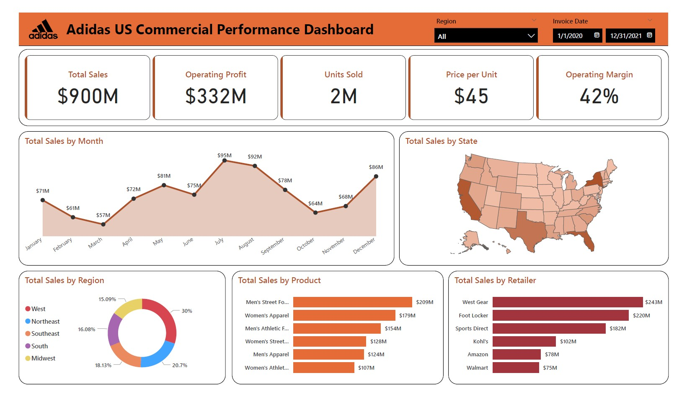

 

# **Adidas US Commercial Performance Dashboard**

 

## **1. Executive Summary**

### **Business Problem**

Adidas lacked a centralized analytical layer to evaluate sales performance vs profitability trade-offs across regions, products, and retail partners. Existing reporting focused on revenue, but failed to explain where profit is actually generated vs diluted.

### **Objective**

Build an executive dashboard that:

* Tracks revenue, profit, and margin simultaneously
* Identifies high-value vs high-volume segments
* Enables faster, data-driven commercial decisions

### **Key Business Outcomes**

* $900M Total Sales | $332M Operating Profit | 42% Margin
* Revenue is concentrated in a small set of retailers, creating dependency risk
* Product performance is uneven; top-selling categories are not always the most profitable
* Seasonality is strong, but Q4 underperforms relative to expected retail trends

### **Core Strategic Insight**

Revenue is concentrated in high-volume segments, but inconsistent margins suggest a volume-first strategy that leaves clear opportunities for profit optimization.

## **2. Business Context**

* **Industry:** Retail / Sportswear & Footwear
* **Stakeholders:**

  * Regional Sales Directors
  * Commercial Operations Team
  * Supply Chain Planners
  * Executive Leadership

### **Why This Matters**

Without a unified analytical view:

* High-revenue channels may silently erode margins
* Inventory decisions are made without demand timing insights
* Growth strategy becomes volume-driven instead of profit-driven

### **Success Metrics**

* **Primary:** Operating Margin (%)
* **Secondary:** Total Sales ($), Operating Profit ($), Units Sold

## **3. Dashboard Overview**

### **Type**

Executive Performance & Commercial Analytics Dashboard

### **Core Components**

* **KPI Layer:** Sales, Profit, Margin, Units
* **Time Series:** Monthly Sales Trend
* **Geographic Analysis:** Sales by State
* **Channel Analysis:** Sales by Retailer
* **Product Analysis:** Sales by Category

### **User Decision Flow**

1. Review top-level KPIs
2. Identify anomaly (e.g., drop in monthly sales)
3. Drill into:

   * Region → Retailer → Product
4. Isolate root cause
5. Trigger business action

## **4. Data Snapshot**

* **Source:** Open Source
* **Time Period:** Jan 2020 – Dec 2021
* **Granularity:** Transaction-level (invoice-based)
* **Structure:** Sales fact table with product, retailer, and geography dimensions

## **5. Data Preparation**

* Standardized column formats
* Removed duplicates and null records

## **6. Key Measures**

* **Total Sales**
* **Operating Profit**
* **Units Sold**
* **Price per Unit**
* **Operating Margin %**

## **7. Dashboard Features & Visualization Logic**

* **Area Chart (Monthly Sales)**
  → Highlights **seasonality + revenue volume intensity**

* **Map (Sales by State)**
  → Identifies **geographic concentration and gaps**

* **Bar Charts (Retailer & Product)**
  → Enables **clear ranking + comparison**

* **Donut Chart (Region Share)**
  → Quick view of **market contribution split**

### **Interactivity**

* Global filters:

  * Region
  * Date
* Cross-filtering across all visuals

## **8. Key Insights**

### **1. Revenue vs Profit Misalignment**

Men’s Athletic Footwear ranks 3rd in revenue (~$154M), but its margin performance does not match its sales strength, indicating a disconnect between top-line contribution and profit efficiency.

**Implication:**
Growth is being driven by high-volume categories that are not necessarily the most profit-efficient, signaling a need to rebalance the product mix toward higher-margin segments.

### **2. Retail Channel Concentration Risk**

* West Gear and Foot Locker dominate sales contribution
* Combined dependency creates channel risk exposure

**Implication:**
Revenue stability is tied to a limited number of partners

### **3. Seasonal Demand Imbalance**
Sales peak significantly in July and August before declining in the fall.

**Implication:**
This dictates inventory planning; the supply chain must ensure peak stock levels by late June to capture the Q3 demand surge.

### **4. Underperformance of Mass Retail Channels**

* Walmart/Amazon generates lower revenue

**Implication:**
Adidas products perform better in environments where the consumer intent is specifically focused on athletic/lifestyle gear rather than general merchandise.

### **5. Geographic Revenue Concentration**

* The West region contributes ~30% of total sales

**Implication:**
Growth is geographically skewed → expansion opportunity in underperforming regions

## **9. Insight → Action Framework**

### **Decision Rules**

* If Operating Margin < 35%
  → Audit pricing, discounting, and logistics costs

* If MoM Sales Decline > 10%
  → Investigate:
  
  * Inventory shortages
  * Retailer performance
  * Product demand shifts

### **Usage Frequency**

* Weekly → Performance tracking
* Monthly → Strategic review
* Quarterly → Resource allocation decisions

## **10. Strategic Recommendations**

### **1. Optimize Retail Channel**

**Problem:**
Sales are overly concentrated in a few retail partners, reducing control over margins.

**Action:**
Shift focus toward higher-margin channels and reduce dependence on low-margin retailers.

**Impact:**
Improves overall profitability through better channel mix.

**Risk:**
Lower sales volume in mass-market channels.

### **2. Fix Q4 Revenue Leakage**

**Problem:**
Sales drop before peak retail season

**Action:**

* Launch early holiday campaigns (Nov)
* Introduce exclusive seasonal product drops

**Impact:**
Recover lost seasonal demand

**Risk:**
Higher marketing spend

### **3. Rebalance Product Strategy**

**Problem:**
Revenue concentration in limited categories

**Action:**

* Invest in underperforming but high-margin segments
* Diversify product portfolio

**Impact:**
Improved margin stability

**Risk:**
Demand uncertainty in new segments

### **4. Reduce Geographic Imbalance**

**Problem:**
Over-reliance on the West region

**Action:**

* Target marketing in underperforming regions
* Expand retail partnerships regionally

**Impact:**
More balanced revenue distribution

**Risk:**
Slower ROI in new markets

## **11. Implementation & Deployment**

* **Tool:** Microsoft Power BI
* **Deployment:** Power BI Service
* **Access:** Executive & Operations Teams

### **Scalability Enhancements**

* Row-Level Security (RLS) for regional views
* Integration with live ERP/CRM systems

## 12. **Limitations**

* Historical dataset (2020–2021 only)
* No granular cost structure (logistics, marketing, etc.)
* No real-time data connectivity

## **13. Next Steps**

 **Phase 2:** Implement Row-Level Security (RLS) based on Regional Manager territories.

**Phase 3:** Integrate a predictive forecasting model using DAX or Python to project future monthly sales based on historical seasonality.

---

© 2026 Mostafizur Rahman

